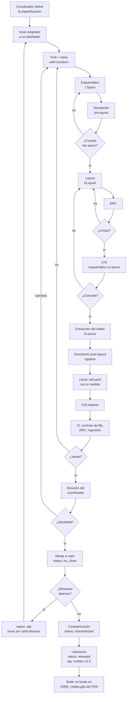
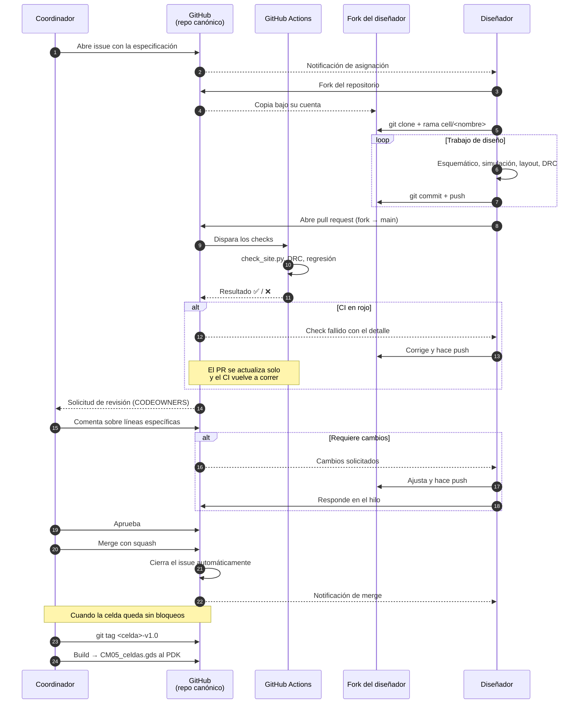

# Manual de operación — CM05_CELLS

Cómo se trabaja en el repositorio de la biblioteca de celdas del proceso
CIDESI_CM05: quién hace qué, en qué orden, y a través de qué mecanismos.

---

## 1. Qué es este repositorio

`CM05_CELLS` es el **entorno de desarrollo** de la biblioteca de celdas. Aquí
viven las fuentes: esquemáticos, testbenches, layouts, evidencia de
verificación y documentación de diseño.

No debe confundirse con `CIDESI_CM05`, que es el **PDK**: un paquete instalable
de KLayout con las capas, las reglas de DRC y LVS, el XSection y los modelos
SPICE. El PDK es lo que un diseñador instala; este repositorio es donde el
trabajo ocurre.

```
CM05_CELLS  (desarrollo)                CIDESI_CM05  (distribución)
├── esquemáticos, testbenches           ├── grain.xml  (paquete salt)
├── evidencia DRC/LVS                   ├── tech/  capas, DRC, LVS, modelos
├── cell.yaml, design.md      ──build──►└── libraries/CM05_celdas.gds
└── historial y revisión por PR              (producto generado)
```

`CM05_celdas.gds` deja de editarse a mano: pasa a ser el artefacto que se
genera desde `digital/cells/` cuando las celdas se liberan.

### Estructura

| Carpeta | Contenido |
|---|---|
| `pdk/` | Copia sincronizada de lo que el PDK aporta al flujo (modelos SPICE) |
| `digital/cells/` | Celdas estándar, una carpeta por celda |
| `digital/pads/` | Celdas de E/S, exentas del contrato de fila |
| `digital/site.yaml` | **El contrato geométrico.** Fuente única de verdad |
| `analog/cells/` | Celdas analógicas, una carpeta por celda |
| `blocks/` | Ensambles que instancian celdas |
| `scripts/` | Verificadores, caracterización, build |
| `docs/` | Este manual y la documentación general |
| `_legacy/` | Material previo sin clasificar. Nada se borra |

---

## 2. Roles

| Rol en el equipo | Nombre en la industria | Permiso en GitHub |
|---|---|---|
| **Coordinador de biblioteca** | *Library Owner* / *Design Manager* | Owner del repositorio, entrada en `CODEOWNERS` |
| **Diseñador de celdas digitales** | *Standard Cell Designer* | Colaborador externo: trabaja en su fork |
| **Diseñador analógico** | *Analog Design Engineer* | Colaborador externo: trabaja en su fork |
| **Verificación automática** | *Continuous Integration* | GitHub Actions |

Nadie escribe directamente en `main`. Los diseñadores trabajan sobre un fork
propio y proponen cambios por pull request. El coordinador es el único que
puede fusionar.

### Coordinador de biblioteca

Define **qué** se construye y decide **cuándo** está listo. No es un rol
administrativo: es quien fija el criterio técnico.

- Escribe las especificaciones: objetivos numéricos de cada celda, contrato
  geométrico en `digital/site.yaml`, convenciones en `CONTRIBUTING.md`.
- Abre y asigna los issues que definen el trabajo.
- Revisa y fusiona los pull requests. Es el único que puede.
- Decide cuándo una celda pasa a `released` y cuándo se congela la biblioteca
  para un tape-off.
- Es dueño de `pdk/`, `blocks/`, `scripts/` y `.github/` — las áreas donde una
  edición equivocada rompe a todo el equipo.

### Diseñador

Construye la celda que le fue asignada y demuestra que cumple.

- Trabaja **solo en el subárbol de su dominio**: `digital/cells/` o
  `analog/cells/`.
- Una celda, un dueño. Los archivos GDS son binarios y Git no puede
  fusionarlos: si dos personas editan el mismo layout, el conflicto se resuelve
  descartando el trabajo de alguien.
- No modifica `pdk/`, `site.yaml` ni los scripts. Si algo ahí le estorba, abre
  un issue.
- Entrega evidencia, no afirmaciones: reportes de DRC, resultados de
  simulación, `cell.yaml` completo.

### Verificación automática

El CI no es un rol humano pero se comporta como uno: revisa cada propuesta
antes que las personas, siempre, sin cansarse. Corre en una máquina limpia de
Ubuntu, así que también detecta las dependencias ocultas del equipo de quien
propuso el cambio.

---

## 3. El ciclo de vida de una celda



### Las tres compuertas

El ciclo tiene tres puntos donde algo puede detenerse, y son deliberadamente
distintos:

1. **El CI** verifica lo mecánico: geometría, contrato de fila, que los
   archivos existan y sean coherentes. Es rápido, objetivo e inapelable.
2. **La revisión del coordinador** verifica lo que una máquina no puede: si la
   topología es razonable, si el apareamiento se cuidó, si la documentación
   explica el porqué.
3. **Los bloqueos** impiden liberar. Una celda puede estar fusionada en `main`
   y seguir teniendo bloqueos abiertos: eso es normal y es la diferencia entre
   *integrada* y *liberada*.

---

## 4. Interacciones a través de GitHub



### Por qué el fork y no una rama directa

En un repositorio bajo cuenta personal, GitHub **solo permite dar permiso de
escritura** a un colaborador: no existe el acceso de solo lectura. Un
colaborador con escritura puede hacer push a cualquier rama.

Con el modelo de fork, nadie escribe en el repositorio canónico salvo el
coordinador. Los diseñadores trabajan en su propia copia y la revisión es
obligatoria por construcción, no por convenio.

---

## 5. Guía del coordinador

### Definir el trabajo

Un issue por celda, desde la plantilla correspondiente
(`.github/ISSUE_TEMPLATE/`). Lo que hace útil a un issue es el **criterio de
aceptación**: sin objetivos numéricos, la revisión se vuelve una discusión de
impresiones.

```
[ANA] ota_5t_1v8

Especificaciones objetivo:
| Spec           | Objetivo | Unidad |
| ganancia       | 40       | dB     |
| ancho de banda | 1        | MHz    |
| consumo        | 50       | µA     |
```

### Revisar un pull request

Antes de leer nada, mirar los checks. Si el CI está en rojo, no hay nada que
revisar todavía.

Después, en este orden:

1. **`cell.yaml`** — el diff dice qué cambió de estado. `status: draft →
   drc_clean` es una afirmación que el resto del PR debe respaldar.
2. **Los números** — specs medidas contra objetivo. Si `measured` está vacío,
   el PR no está listo.
3. **`design.md`** — ¿explica *por qué*, no solo *qué*? Un layout sin
   razonamiento documentado es deuda para el próximo diseñador.
4. **El layout** — captura del XOR de KLayout contra la versión anterior.

Comentar sobre líneas específicas, no en un bloque general: así la discusión
queda anclada al lugar exacto.

### Marcar trabajo pendiente

Cuando algo no está listo pero el trabajo sí debe integrarse, se registra como
bloqueo en el `cell.yaml` de la celda:

```yaml
status: wip

blockers:
  - id: dimensiones-discrepantes
    severity: alta
    summary: >
      El esquemático usa PMOS w=25u / NMOS w=10u; el layout usa W=50U / W=15U.
      La versión correcta es la del layout.
    owner: "usuario-github"
    issue: 42
```

Es texto, así que diffea; es estructurado, así que un script lo cuenta; y el
campo `issue` lo conecta con el lugar donde se está resolviendo.

**La regla que lo hace real: una celda con bloqueos abiertos no puede pasar a
`released`.**

### Liberar

```bash
git tag inv_x1-v1.0          # celda validada
git tag mpw-2026-11          # congelamiento para tape-out
git push origin --tags
```

Un tag de tape-out congela el estado exacto de toda la biblioteca. Es lo que
permite responder, dos años después, con qué versión de qué celda se fabricó
un chip.

---

## 6. Guía del diseñador

### Alta, una sola vez

```bash
# 1. Fork desde la interfaz de GitHub, luego:
git clone https://github.com/<tu-usuario>/CM05_CELLS.git
cd CM05_CELLS
git remote add upstream https://github.com/RodSchz/CM05_CELLS.git
```

No coloques el repositorio dentro de OneDrive: la sincronización corrompe la
carpeta `.git`.

### Cada celda nueva

```bash
git fetch upstream
git checkout -b cell/<nombre> upstream/main
cp -r analog/_template analog/cells/<nombre>     # o digital/_template
```

Trabaja. Haz commits pequeños con mensajes que digan qué cambió:

```
inv_x1: layout inicial, DRC limpio
ota_5t_1v8: corrige espejo de corriente, mejora PSRR 8 dB
```

### Antes de proponer

Corre el verificador tú mismo. Es el mismo que corre el CI, así que si pasa
aquí, pasa allá:

```bash
python scripts/drc/check_site.py --config digital/site.yaml \
  digital/cells/<nombre>/layout/<nombre>.gds
```

Llena el `cell.yaml`. Los campos `measured` vacíos son la razón más común por
la que un PR se devuelve.

### Proponer

```bash
git push origin cell/<nombre>
```

GitHub te ofrece el enlace para abrir el pull request. Llena la plantilla
completa — el checklist no es burocracia: es lo que el coordinador va a
verificar de todas formas, y llenarlo tú ahorra una ronda de ida y vuelta.

### Cuando piden cambios

No abras un PR nuevo. Corrige en la misma rama y haz push: el pull request se
actualiza solo y conserva toda la discusión.

```bash
git commit -am "inv_x1: corrige altura de fila"
git push origin cell/<nombre>
```

---

## 7. Estados y bloqueos

```
wip → migrated → drc_clean → lvs_clean → characterized → released
```

| Estado | Significa |
|---|---|
| `wip` | En trabajo. Tiene bloqueos abiertos |
| `migrated` | Traída de material previo, sin verificar |
| `drc_clean` | DRC limpio |
| `lvs_clean` | LVS sin discrepancias |
| `characterized` | Caracterizada, con `.lib` generado |
| `released` | Liberada. **Requiere cero bloqueos abiertos** |

El estado vive en `cell.yaml` y el índice de cada biblioteca
(`digital/cells/README.md`) lo agrega automáticamente.

---

## 8. Convenciones

### Nomenclatura

- **Digital:** `<función>_<drive>` — `nand2_x1`, `inv_x1`.
- **Analógico:** descriptiva — `ota_5t_1v8`, `bandgap_ref`, `cmirror`.
- Minúsculas, dígitos y guion bajo. Sin espacios ni acentos.
- **Cuidado con las mayúsculas:** en Windows `XNOR2x1` y `XNOR2X1` son el mismo
  archivo; en el runner Linux del CI son dos distintos.

El nombre de la carpeta, el de la celda en el esquemático, el del GDS y el del
subcircuito SPICE **deben ser idénticos**. El nombre viaja del esquemático al
netlist, al layout y al LVS: es donde más se rompen los flujos de diseño.

### Qué se versiona

**Sí:** `.asc`, `.asy`, `.cir`, `.spice`, `.gds`, `.oas`, `.lyp`, `.lym`,
`.xs`, `.lydrc`, `cell.yaml`, documentación.

**No:** `.raw`, `.log`, `.fft`, netlists generados, archivos de bloqueo. Ver
`.gitignore`.

### Los dos entornos de simulación

No son copias uno del otro: verifican etapas distintas.

| Carpeta | Parte de | Representa |
|---|---|---|
| `ltspice/` | El esquemático dibujado | El circuito ideal, pre-layout |
| `ngspice/` | El netlist extraído por KLayout | El circuito real, tal como quedó |

El testbench de ngspice **no lee el `.asc`**, así que no puede quedar
desincronizado con él. La diferencia entre ambos resultados es el dato de
interés: cuánto se aparta el dibujo del ideal.

Cada medición en `cell.yaml` declara su origen:

```yaml
- {name: ratio, measured: 1.0016, sim: ngspice, stage: extracted}
```

### Jerarquía y netlist

> **Jerarquía dentro de una unidad de trabajo; netlist en las fronteras de
> liberación.**

Una celda en diseño usa símbolo jerárquico dentro de su propia carpeta: es una
unidad, nadie más la toca, y no hay copia derivada que envejezca.

Un bloque consume celdas **liberadas**, y las consume por `.subckt` exportado
con `.inc`. Exportar el netlist de una celda que se edita a diario es frágil;
exportarlo cuando la celda se libera es simplemente parte de liberar.

---

## 9. Cómo van a crecer los roles

La estructura actual admite la división que el equipo va a necesitar sin
rehacer nada:

| Rol futuro | Nombre en la industria | Sobre qué trabajaría |
|---|---|---|
| Diseñador de circuito | *Circuit Designer* | `ltspice/` — esquemático y simulación |
| Diseñador de layout | *Layout / Mask Designer* | `layout/` — dibujo físico |
| Ingeniero de verificación | *Physical Verification Engineer* | `results/`, revisión de DRC y LVS |
| Ingeniero de diseño físico | *Physical Design Engineer* | Síntesis, colocación y ruteo |

El mecanismo para introducirlos ya existe: **`CODEOWNERS`**. Basta con asignar
subárboles distintos a personas distintas y GitHub solicitará automáticamente
la revisión de quien corresponda.

```
/analog/cells/*/ltspice/   @diseñador-circuito
/analog/cells/*/layout/    @diseñador-layout
/*/cells/*/results/        @verificacion
/pdk/  /scripts/           @RodSchz
```

La división clásica de la industria analógica es precisamente esa: el
diseñador de circuito define la topología y el dimensionamiento; el diseñador
de layout lo dibuja cuidando apareamiento y parásitos. Que hoy sea la misma
persona no impide preparar la separación.

---

## 10. Referencia rápida

| Quiero… | Comando |
|---|---|
| Sincronizar mi fork | `git fetch upstream && git rebase upstream/main` |
| Empezar una celda | `git checkout -b cell/<nombre> upstream/main` |
| Verificar el contrato | `python scripts/drc/check_site.py --config digital/site.yaml <gds>` |
| Simular post-layout | `cd analog/cells/<n>/ngspice && ./run.sh` |
| Proponer cambios | `git push origin cell/<nombre>` y abrir el PR |
| Ver el estado global | `digital/cells/README.md` |

### Enlaces

- Contrato geométrico: `digital/docs/site_rules.md`
- Guía de contribución: `CONTRIBUTING.md`
- Modelos SPICE: `pdk/tech/models/LEEME.md`
- PDK: <https://github.com/RodSchz/CIDESI_CM05>
